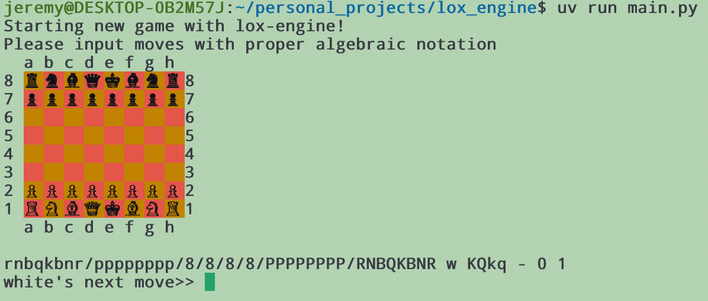

# lox_engine
>Version 1.0.0

Lox engine is a rudimentary chess engine and game platform where you can play against Lox, a basic chess engine, or against your friends in timed or untimed games.

## What is lox_engine?
Currently, lox_engine is a terminal based chess game that parses algebraic notation to make moves on the board. After each move, lox_engine will display the game board and the FEN string representing the game, so you can save or transport the game to another instance of lox_engine or any other chess platform.

### What are the limitations?
As of the current version, lox_engine lacks these key features that many a complete chess engine would have:
    
    - Detecting stalemate
    - Detecting checkmate
    - Detecting 50 move rule draws
    - Exporting game to PGN
    - Graphic user interface for games
    - Ability to play against you

**That last point is key:** the whole idea of lox_engine is to play against you. It might never be a challenger to the likes of Stockfish or Leela Chess Zero, in fact it would probably get smoked, but I plan to write an engine that can play to at least a 2000 Elo level.

## Table of Contents:
 - [Installation](#installation)

 - [How to Use](#how-to-use)

 - [About](#about)

## Installation
> lox_engine uses the Astral uv package manager, which can be downloaded and installed by going to [this installation page](https://docs.astral.sh/uv/getting-started/installation/) and following to the instructions for your platform.

Download and install lox_engine from the [GitHub page](https://github.com/jman2476/lox_engine), then (*after installing uv package*) open your terminal emulator of choice and navigate inside the lox_engine repository.

Run `uv` in the terminal to confirm that the package manager is installed properly, then run:
> For Apple/Linux: `source .venv/bin/activate`

> For Windows: `source .venv/Scripts/activate`

This will start the virtual environment for running the program. When you are done with the program, you can deactivate the virtual environment by closing the terminal window.

### Extras to make it look nice:
One of the cruelest features of Unicode is that only one chess piece emoji exists: the black pawn emoji. This creates situations where every piece renders properly except the black pawns. If this bothers you as much as it bothers me, please install the included font: Nishiki Teki. It doesn't have the nicest letter characters, so I don't suggest you make it the only font for your terminal, but assuming your terminal emulator allows for multiple fonts per terminal profile, do the following:

- Create a new profile for your terminal
- Add Nishiki Teki as the second font for the profile
    - This will make the first font the default, and will only use the chess piece characters of the second font
- Increase the font size to 20-60 pt, depending on your preference and screen size
- Turn off any settings that would change the color of characters based on the background color of the terminal
    - If left on, the pieces may change between white and black (font color, not the characters themselves) whether the piece is on a light or dark square
- Mess around with other visual settings until the board looks nice

## How to Use
To start lox_engine, navigate to its directory in your terminal. and run `uv run main.py` to start a new game.
> The first time you do this, any uninstalled packages will be downloaded and installed. Be sure to activate the virtual environment so that the packages will only be installed in the virtual environment and not globally on your computer.

> To start a game from a position with a FEN string, run: `uv run main.py "[FEN string]"`
> - Example: `uv run main.py "rnbqkbnr/ppp1ppp1/3p4/7p/3P4/P7/1PP1PPPP/RNBQKBNR w KQkq h6 0 3"`

On each move, the program will print:

1. The game board
2. The game's FEN string
3. The move prompt

The move prompt will indicate whose turn it is, and all moves should be input using algebraic chess notation. If you need any help encoding your moves, please refer to [this Wikipedia article](https://en.wikipedia.org/wiki/Algebraic_notation_(chess)). 

Any incorrectly encoded or invalid moves will raise an error and you will be prompted again to make that move. If you are in check and your move doesn't remove the threat, or if your move would put you in check, the move gets reverted, an error will be raised, and you will be prompted again to make a move.

Because lox_engine currently cannot detect if there is checkmate or stalemate on the board, the game is over if there are no moves that can be made.

## About

Written by Jeremy McKeegan

### Packages
colorama 0.4.6

### Contributing
I'm writing this on my own, so I am not interested in merging any updates you write. However, if you find any errors, or have any suggestions, you are more than welcome to write an issue on the [GitHub repo](https://github.com/jman2476/lox_engine).
