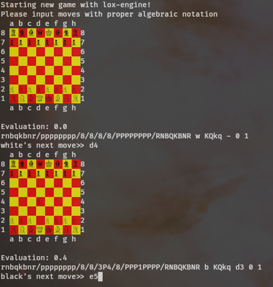
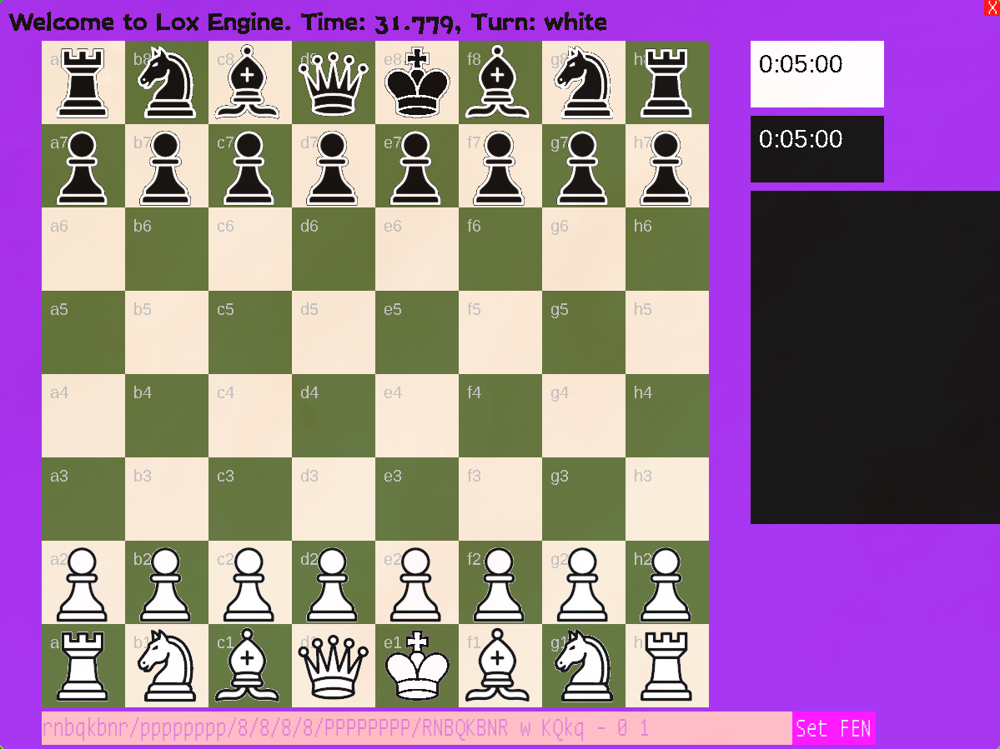

```
██╗      ██████╗ ██╗  ██╗    ███████╗███╗   ██╗ ██████╗ ██╗███╗   ██╗███████╗
██║     ██╔═══██╗╚██╗██╔╝    ██╔════╝████╗  ██║██╔════╝ ██║████╗  ██║██╔════╝
██║     ██║   ██║ ╚███╔╝     █████╗  ██╔██╗ ██║██║  ███╗██║██╔██╗ ██║█████╗  
██║     ██║   ██║ ██╔██╗     ██╔══╝  ██║╚██╗██║██║   ██║██║██║╚██╗██║██╔══╝  
███████╗╚██████╔╝██╔╝ ██╗    ███████╗██║ ╚████║╚██████╔╝██║██║ ╚████║███████╗
╚══════╝ ╚═════╝ ╚═╝  ╚═╝    ╚══════╝╚═╝  ╚═══╝ ╚═════╝ ╚═╝╚═╝  ╚═══╝╚══════╝
                                                                             
```
*"It's called Lox Engine because it would get smoked by [Stockfish](https://github.com/official-stockfish/stockfish)" -- Jeremy McKeegan, creator*
# lox_engine: Python chess platform
Lox Engine is a Python based chess platform with command-line and graphical interfaces. Lox features human vs human games, multiple levels of chess engines, and game saving and replaying.

<div style="display:flex">
<figure>
    
    <figcaption>Command-line interface for Lox Engine</figcaption>
</figure>
<figure>
    
    <figcaption>Graphical interface for Lox Engine</figcaption>
</figure>
</div>

## Why did I build another chess engine?
Chess engines like [Stockfish](https://stockfishchess.org/) and [Leela Chess Zero](https://lczero.org/) are practically the gods and truthsayers of the chess world, but their logic is so far beyond our comprehension of the game that we can only guess the reasoning behind their move choices. I set out to build Lox Engine to illustrate the difference in gameplay and board knowledge that comes with designing engines with different levels of computer chess theory. The parallel aim of this project is to develop a comparison between how humans and computers perceive the chess board.

The engines, in order of strength:
- Fool: Makes random moves, imitating how a beginner might play after learning the rules of chess.
- Naive: Evaluates the board using ideas taught to chess students, or approximations of those heuristics, to choose the best move. 
    - Estimated to be ~200-400 Elo. 
    - Can be configured to search multiple moves ahead.
- Fast: Based on the Naive engine, but reoptimized to play quickly and look ahead more efficiently.
- Informed (upcoming): First engine in the series to be based on existing theory of computer chess, which will incorporate fewer human-oriented evaluation algorithms.
- Machine Learning (upcoming): Will use machine learning to learn the best way to play chess, and designed to emulate the best chess engines on the market today. 

## Why did I build another chess engine?
Chess engines like [Stockfish](https://stockfishchess.org/) and [Leela Chess Zero](https://lczero.org/) are practically the gods and truthsayers of the chess world, but their logic is so far beyond our comprehension of the game that we can only guess the reasoning behind their move choices. I set out to build Lox Engine to illustrate the difference in gameplay and board knowledge that comes with designing engines with different levels of computer chess theory. The parallel aim of this project is to develop a comparison between how humans perceive the chess board and how computers see it.

The engines, in order of strength:
- Fool: Makes random moves, imitating how a beginner might play after learning the rules of chess.
- Naive: Evaluates the board using ideas taught to chess students, or approximations of those heuristics, to choose the best move. 
    - Estimated to be ~200-400 Elo. 
    - Can be configured to search multiple moves ahead.
- Fast: Based on the Naive engine, but reoptimized to play quickly and look ahead more efficiently.
- Informed (upcoming): First engine in the series to be based on existing theory of computer chess, which will incorporate fewer human-oriented evaluation algorithms.
- Machine Learning (upcoming): Will use machine learning to learn the best way to play chess, and designed to emulate the best chess engines on the market today. 


## Quick Start: I want to play NOW!

### 1. Prerequisits

## Usage: What else can I do with it?

### TUI vs GUI

### Play from a position

### Watch the engine play itself

### Replay a game

### Postgame Analysis

## Contributing: 
### Lemme touch that code!


## What's next?
